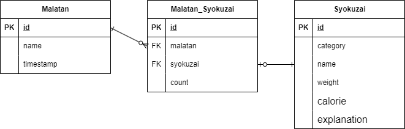

## サービスのURL

**[マーラータンジェネレーター](https://malatangenerator.onrender.com/)**  
> ※ 15分以上リクエストがない場合、起動に時間を要します。

## アプリケーション概要

マーラータンの具材選択をシミュレーションできるアプリです。  
お店と同じ流れを意識しています。

- 好きな具材を好きな数だけ選択  
- 最後に計量を行って合計を確認

## 使用技術
| Category          | Technology Stack                                     |
| ----------------- | --------------------------------------------------   |
| Frontend          | JavaScript                       |
| Backend           | Ruby on Rails                           |
| Infrastructure    | Render                          |
| Database          | PostgreSQL                                           |
| CI/CD             | GitHub Actions                                       |

## E-R図
